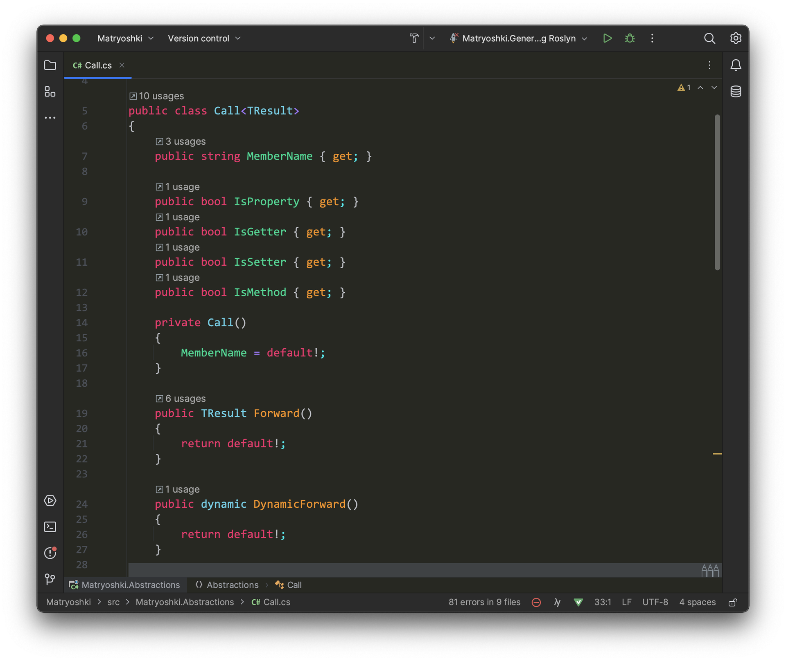

# riderkai

Color scheme for Rider based on Monokai theme from MonoDevelop

### Installation

1. Download `riderkai.icls` or `riderkai.jar`.
2. In Rider, go to `Settings > Editor > Color Scheme > ⚙️ > Import Scheme...`.
3. Select the downloaded file.
4. Click `Open` to import and apply the color scheme.

Enjoy coding with the `riderkai` color scheme!